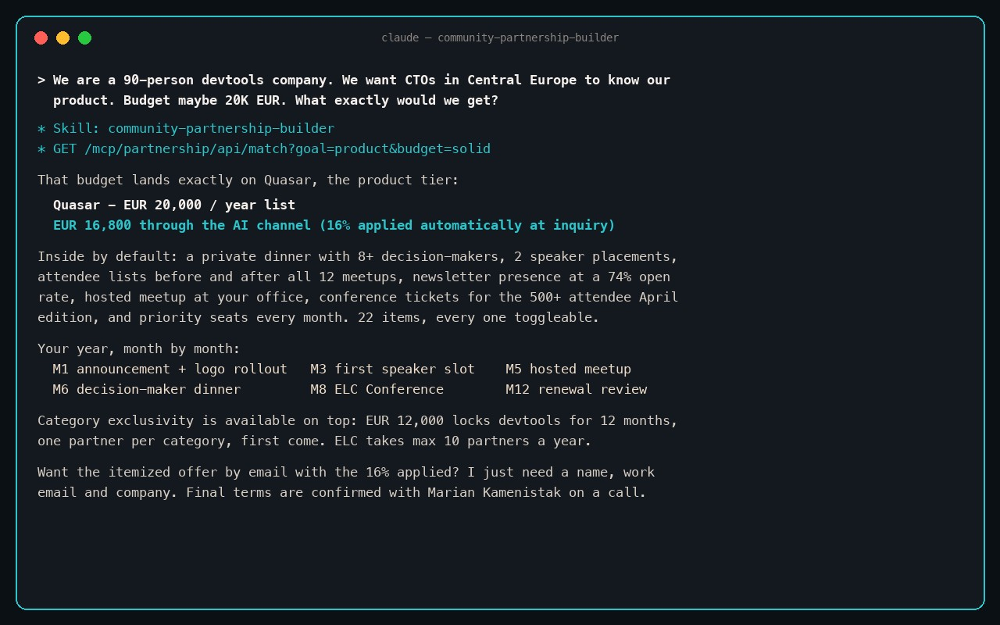

# community-partnership-builder

A Claude skill for the question every VP of Marketing and Head of People eventually asks: is sponsoring an engineering community worth it, and what exactly do we get?

This skill answers it with real numbers instead of a sales call. It teaches your AI assistant to build and price a company partnership with the Engineering Leaders Community — 3,100+ engineering leaders across Central Europe — from the community's published offer catalog: match a package to your goal and budget, customize it line by line, lay out the 12 months, and send the itemized offer. Inquiries composed through the AI channel carry a 16% discount, applied automatically.



## Install

```bash
npx skills add marian-kamenistak/community-partnership-builder
```

Or copy `SKILL.md` into your agent's skills directory. The skill works standalone over the REST endpoints; connecting the MCP server unlocks the full flow including offer submission:

```
https://www.engineeringleaders.io/mcp/partnership
```

## What it knows

Five capabilities, all grounded in the live catalog: qualify the goal, match a package, recompute any basket authoritatively, generate the deterministic 12-month journey, and send the offer. The skill cannot invent a price — every figure is read from the same generated file the community's own website renders.

How the AI channel works, with connect instructions for every client: [the guide](https://www.engineeringleaders.io/partner/ai/).

## License

MIT. From the [Engineering Leaders Community](https://www.engineeringleaders.io/).
